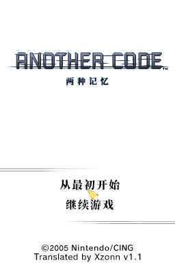

# 《Another Code 两种记忆》汉化

## 基本说明
本项目是对《Another Code 两种记忆》（アナザーコード 2つの記憶，异色代码 双重记忆）的简体中文的本地化。

相较于 PGCG 汉化组制作的旧汉化版，本汉化对游戏中图片的文本进行了翻译。

人名等专有名词的译名参照了《Another Code 回忆录：两种记忆／记忆之门》官方中文版的翻译，部分文本因技术限制未能与官方中文版保持一致。

## 使用方式
请自行获取游戏日文版 ROM，然后下载 [修正补丁](https://github.com/Xzonn/ACTMChsLocalization/releases/latest) 和 [补丁应用工具](https://github.com/Xzonn/NitroPatcher/releases/latest/)，按照工具的说明进行操作。

日文版 ROM 校验码（[No-Intro](https://datomatic.no-intro.org/index.php?page=show_record&s=28&n=0039)）：

- CRC32：`ec861ab2`
- MD5：`5933d51fd3bfce700fea8a61e6783fc2`
- SHA-1：`a2ea8009a0a85544ff87b437f9475f54455983c1`

## 截图预览
  

## 授权协议
本项目使用 **[CC BY-NC-SA 4.0](https://creativecommons.org/licenses/by-nc-sa/4.0/legalcode)** 协议授权。若您想基于本项目进行二次创作，请遵守协议内容。这些内容主要包括：

- **署名**：您必须标明本项目的作者（Xzonn），并在您的作品中提供指向本项目的链接。
- **非商业性使用**：您不得将本项目用于商业目的。
- **相同方式共享**：若您基于本项目进行二次创作，您必须以相同的协议授权您的作品。

请阅读本项目的 **[完整授权协议](LICENSE)** 以了解更多信息。
